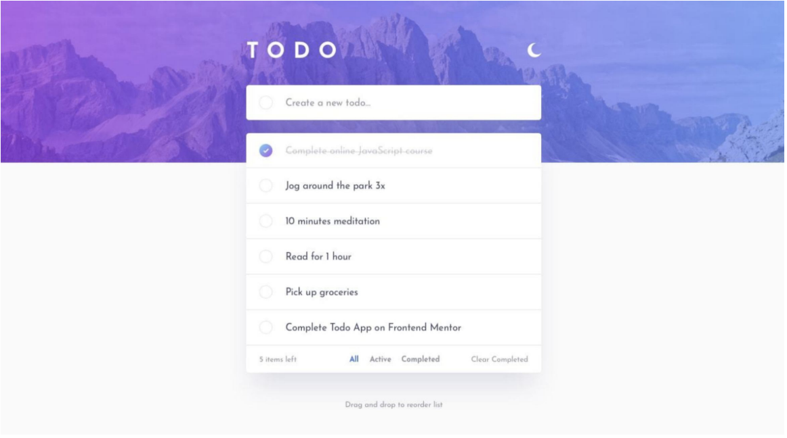

# Synebo Todo

## GH Pages

You can check the App on the https://mariiasuper.github.io/synebo-todo/

## Start App (dev mode)

```
npm i
npm start
```

### Build App

```
npm i
npm run build

# you can serve it by command:
serve -s build
```

## Tech stack

- React
- Redux + Toolkit
- Sass + BEM
- React DnD
- Create rect App
- GitPub workflow + GitPub pages

## Features

- Add / Remove / Toggle complete Todo
- Filter by Todo state
- Clear all Completed
- Drag'n'Drop (Desktop and mobile devices)

## Task definition / challenge

Your users should be able to:

- View the optimal layout for the app depending on their
  device's screen size
- See hover states for all interactive elements on the page
- Add new todos to the list
- Mark todos as complete
  Your challenge is to build out this todo app and get it looking as close to the design as possible.
  You can use any tools you like to help you complete the challenge. So if you've got something you'd like to
  practice, feel free to give it a go.

- Delete todos from the list
- Filter by all/active/complete todos
- Clear all completed todos
- **Bonus**: Drag and drop to reorder items on the list

Feel free to use any workflow that you feel comfortable with. You can choose Angular/React framework or
other solutions. It’s important to use GIT and Github for this project and do commits throughout the work.
Your final result must be published to GitHub pages.


